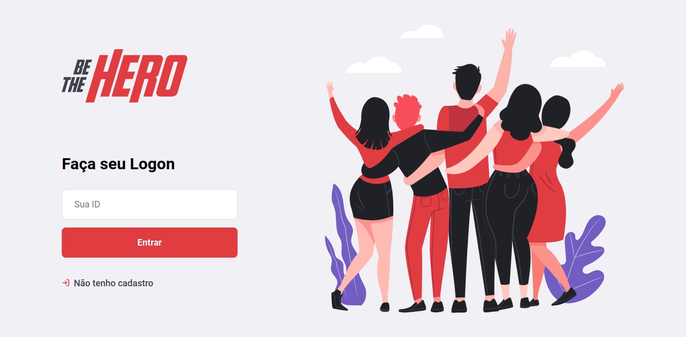
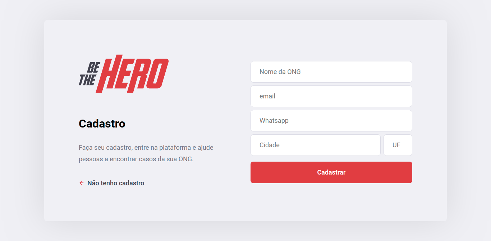
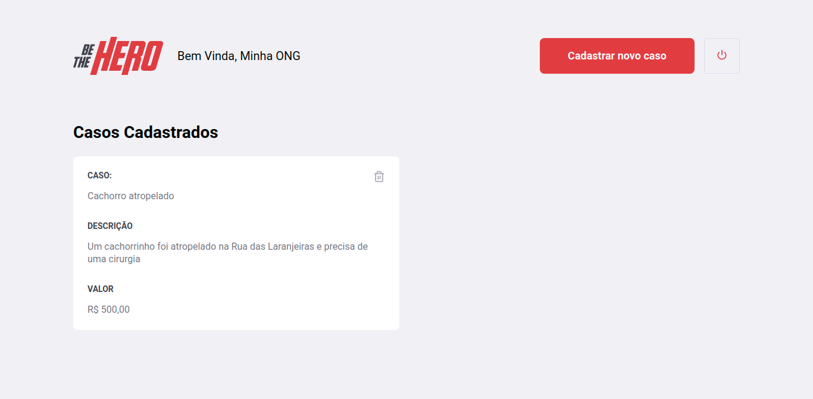
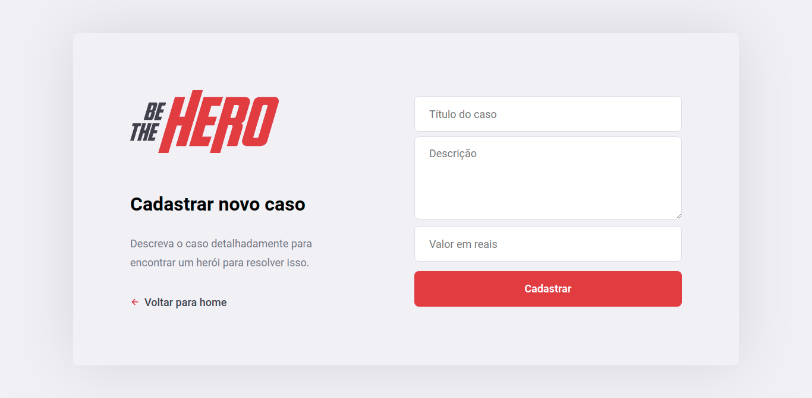

# Be The Hero - Frontend


**Be The Hero** é o projeto da Semana OmniStack 11, oferecido pela [Rocketseat](https://rocketseat.com.br/)

O projeto visa conectar pessoas que queiram ajudar e ONGs que precisem de ajuda

Essa é aplicação web do projeto, destinada às ONGs que desejam cadastrar pedidos de ajuda

O código é feito usando ReactJS para exibir os componentes visuais e o Axios para fazer as chamadas para a [API](https://github.com/GuilhermeBalog/be-the-hero-backend) do Be The Hero

## Screenshots

### Login:



### Cadastro:



### Perfil:



### Adicionar Incidente:



## Instalando na sua máquina

Requisitos:

- Node.js
- npm

```bash
git clone https://github.com/GuilhermeBalog/be-the-hero-frontend.git
cd be-the-hero-frontend
npm install
npm start
```
